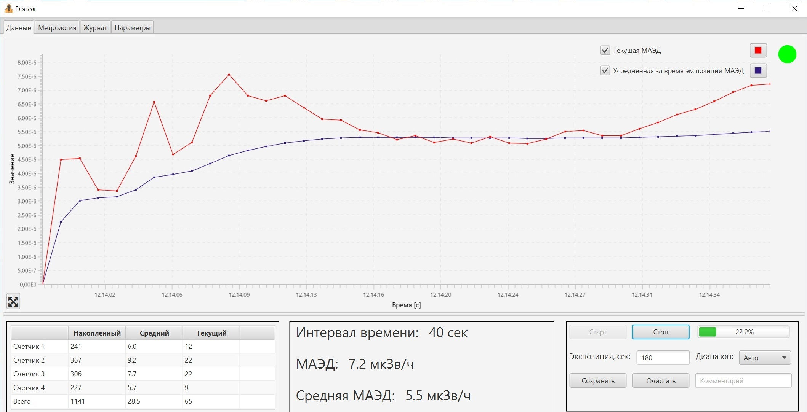
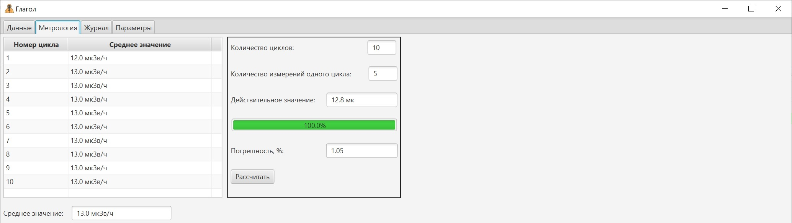
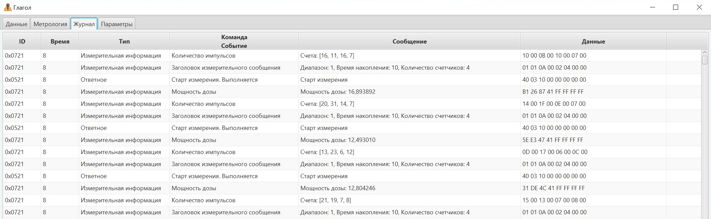
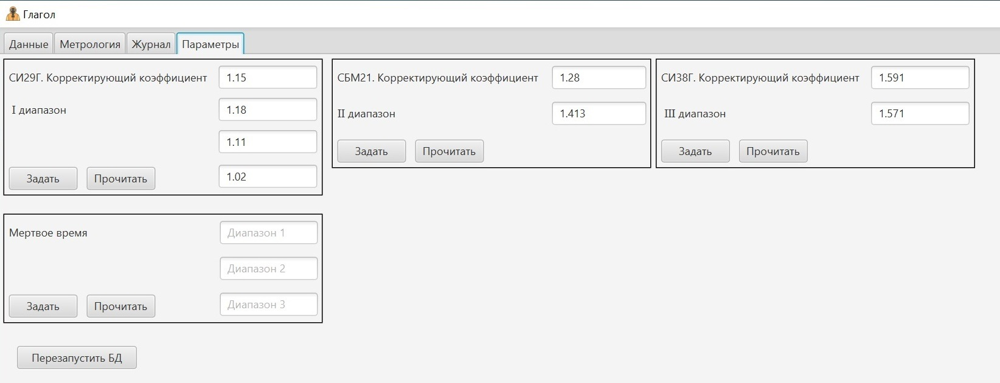

# Глагол

Desktop приложение для управления детектором радиационного и дозиметрического контроля. Включает в себя функциональность для визуализации данных,
снятия метрологических характеристик и конфигурации детектора.

## Стек технологий
- **Java 17**
- **JavaFX**
- **JNA**

## Оборудование

Проект разрабатывался и тестировался с использованием следующего оборудования:

*   **USB-CAN модуль:** SYSTEC electronic USB-CANmodul. Подключается к ПК через USB и обеспечивает интерфейс с CAN-шиной.
*   **Базовые дозиметры (БД):** Устройства, поддерживающие протокол "Глагол", такие как:
    *   БДБГ-РТК (Базовый дозиметр бытового назначения с гамма-радиометром)
    *   БДПН (Базовый дозиметр по нейтронам)
    *   И другие типы БД, реализующие протокол.
*   **Датчики излучения:** В зависимости от типа БД:
    *   СИ-29Г, СБМ-21, СИ-38Г (для БДБГ-РТК)
    *   Другие датчики, соответствующие спецификации конкретного типа БД.

## Архитектура

*   **`CanTransfer`:** Класс, инкапсулирующий взаимодействие с USB-CAN модулем через JNA.
*   **`GlagolParser`:** Отвечает за разбор байтовых CAN-сообщений в Java-объекты.
*   **`RootController`:** Центральный контроллер приложения, управляющий основной логикой и жизненным циклом.
*   **`NodeController`:** Базовый класс для контроллеров отдельных вкладок (Измерения, Метрология, Журнал, Управление).
*   **`MainWindow`:** Создает и настраивает главное окно приложения.
*   **`StatisticMeasService`:** Обрабатывает измерительные сообщения и накапливает статистику.
*   **`MetrologyService`:** Обрабатывает измерительные сообщения и снимает метрологические характеристики с детектора.

